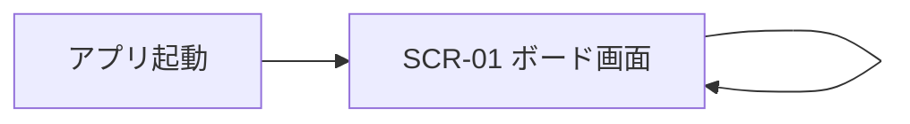
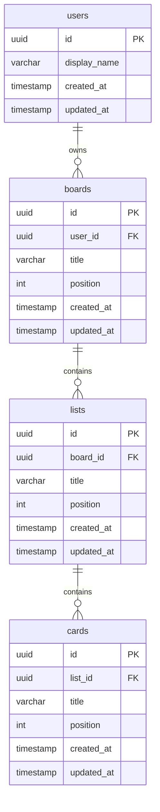
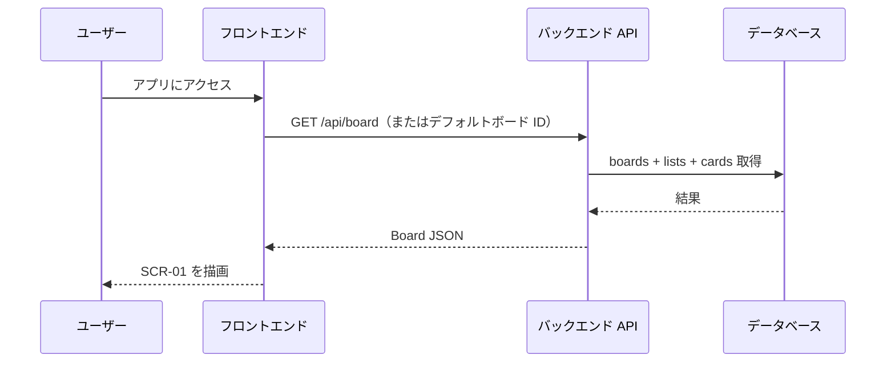
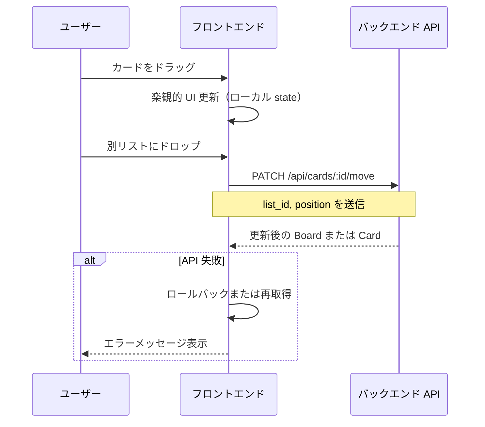
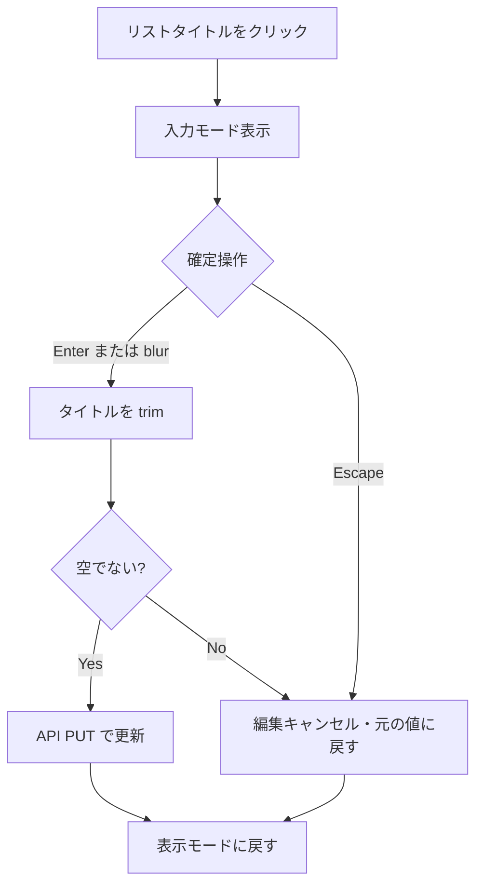
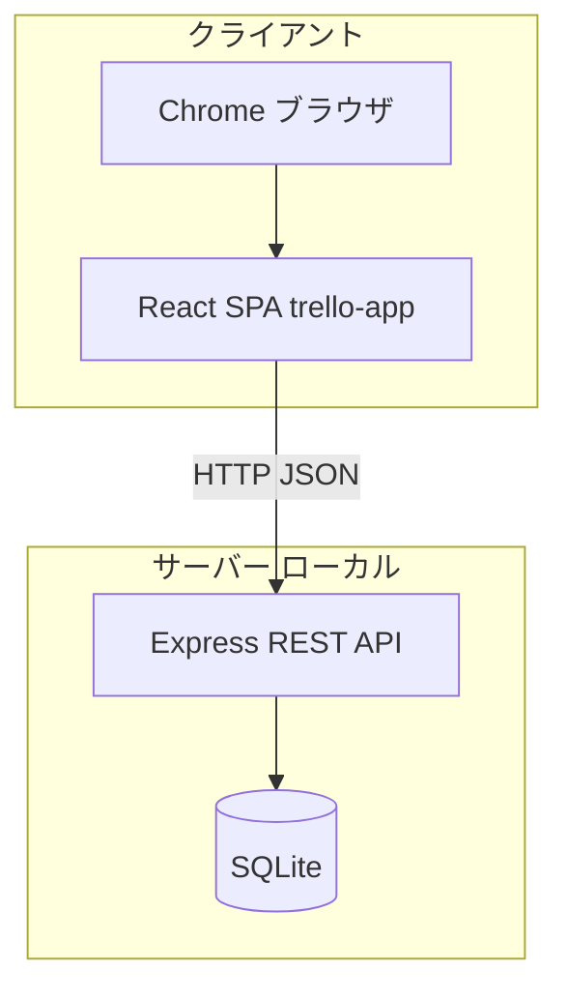

# 要件定義書 — Trello 風タスク管理アプリ

## 1. プロジェクト背景・目的

### 1.1 背景

本プロジェクトは**スクール（プログラミング学習塾）の学習課題**として作成する。  
実務に近い Web アプリ開発の流れ（要件定義 → 画面設計 → 実装 → 動作確認）を体験し、フロントエンドとバックエンドを組み合わせた CRUD・永続化・UI 操作の習得を目的とする。

### 1.2 目的

Trello に着想を得た、カンバン方式のタスク管理 Web アプリケーションを構築する。  
複数のリスト（列）とカード（タスク）を直感的に操作でき、進捗を視覚的に管理できる。  
学習課題として提出・レビュー可能な完成度（起動手順の明確さ、主要機能の動作、データの永続化）を満たすことを目標とする。

### 1.3 スコープ

| 区分 | 内容 |
|------|------|
| スコープ内 | 単一ボード表示、リスト・カードの CRUD、ドラッグ&ドロップ、バックエンド API 経由の永続化、シングルユーザー利用 |
| スコープ外 | 複数ボード切替、カード詳細モーダル、チェックリスト、本格的な認証・マルチテナント、検索・フィルター |

---

## 2. 画面設計

本アプリは**単一画面（ボード画面）**構成とする。モーダルや別ページへの遷移は行わない。

### 2.1 画面一覧

| 画面 ID | 画面名 | 説明 |
|---------|--------|------|
| SCR-01 | ボード画面 | アプリの唯一の画面。ボード・リスト・カードを一覧表示し、すべての操作を行う |

### 2.2 画面遷移



起動時に常に SCR-01 を表示する。画面遷移は発生しない。

### 2.3 SCR-01 ボード画面 — レイアウト

```
┌──────────────────────────────────────────────────────────────────┐
│ 領域 A: ボードヘッダー（全幅・固定高さ）                          │
│   [ボードタイトル]                                                │
├──────────────────────────────────────────────────────────────────┤
│ 領域 B: リストエリア（横スクロール・可変高さ）                    │
│ ┌────────────┐ ┌────────────┐ ┌────────────┐ ┌─────────────────┐ │
│ │ 領域 C     │ │ 領域 C     │ │ 領域 C     │ │ 領域 D          │ │
│ │ リスト列   │ │ リスト列   │ │ リスト列   │ │ リスト追加      │ │
│ └────────────┘ └────────────┘ └────────────┘ └─────────────────┘ │
└──────────────────────────────────────────────────────────────────┘
```

| 領域 | 役割 |
|------|------|
| A | ボードタイトルの表示・インライン編集 |
| B | リスト列の横並び表示。オーバーフロー時は横スクロール |
| C | 1 リスト分の UI（ヘッダー・カード一覧・カード追加） |
| D | 新規リスト追加のトリガーおよび入力フォーム |

### 2.4 UI コンポーネント仕様

#### 2.4.1 ボードヘッダー（領域 A）

| 要素 | 状態 | 表示・操作 |
|------|------|------------|
| ボードタイトル | 表示 | 左寄せ、白文字・太字（約 22px）。ホバーで背景ハイライト。クリックで編集モードへ |
| ボードタイトル | 編集 | テキスト入力。Enter またはフォーカスアウトで保存。Escape でキャンセル |
| 背景 | — | 青系グラデーション（Trello 風）。全画面の最背面 |

#### 2.4.2 リスト列（領域 C）

| 要素 | 状態 | 表示・操作 |
|------|------|------------|
| リストヘッダー | 表示 | 背景グレー系。タイトル（太字）＋削除ボタン（×）。ヘッダー全体がリスト D&D のドラッグハンドル |
| リストタイトル | 編集 | クリックで入力欄に切替。Enter / blur で保存、Escape でキャンセル |
| 削除ボタン | — | クリックでリスト即削除（確認ダイアログなし）。配下のカードも削除 |
| カードエリア | — | 縦方向にカードを積む。ドロップゾーン。ドラッグ中はハイライト |
| カード追加トリガー | 表示 | 「+ カードを追加」リンク風ボタン |
| カード追加フォーム | 入力 | 複数行テキストエリア、追加ボタン、キャンセル（×）。Enter で追加（Shift+Enter は改行） |

リスト列の寸法目安: 幅 272px 前後、角丸 8px、カードエリアは最大高さ制限＋縦スクロール可。

#### 2.4.3 カード（領域 C 内）

| 要素 | 状態 | 表示・操作 |
|------|------|------------|
| カード本体 | 表示 | 白背景・影付き。タイトルテキスト。ホバーで削除ボタン表示 |
| カードタイトル | 編集 | クリックでテキストエリア。Enter / blur で保存、Escape でキャンセル |
| 削除ボタン | — | × クリックで即削除 |
| ドラッグ | — | カード全体がドラッグハンドル。ドラッグ中は半透明・影強調 |

#### 2.4.4 リスト追加（領域 D）

| 要素 | 状態 | 表示・操作 |
|------|------|------------|
| トリガー | 表示 | 「+ リストを追加」ボタン（半透明背景） |
| 入力フォーム | 入力 | タイトル入力、追加ボタン、キャンセル。Enter で追加 |

### 2.5 視覚・インタラクション共通仕様

| 項目 | 仕様 |
|------|------|
| カラーパレット | ボード背景: `#0079bf` 系、リスト: `#ebecf0` 系、カード: `#ffffff` |
| フォント | システム UI フォント（`Segoe UI`, `sans-serif` 等） |
| D&D フィードバック | ドラッグ中の要素は不透明度低下、ドロップ先は背景色変化 |
| 空状態 | カード 0 件のリストも列として表示。リスト 0 件時は追加ボタンのみ表示可 |
| エラー表示 | API 失敗時は画面上部またはトーストで簡易メッセージ（詳細なバリデーション UI は設けない） |

### 2.6 ワイヤーフレーム（参考）

```
┌─────────────────────────────────────────────────────┐
│  [ボードタイトル]                                    │
├─────────────────────────────────────────────────────┤
│ ┌──────────┐  ┌──────────┐  ┌──────────┐  ┌──────┐ │
│ │ リストA  │  │ リストB  │  │ リストC  │  │ ＋   │ │
│ │──────────│  │──────────│  │──────────│  │ 追加 │ │
│ │ カード1  │  │ カード3  │  │          │  └──────┘ │
│ │ カード2  │  │          │  │          │           │
│ │ ＋ 追加  │  │ ＋ 追加  │  │ ＋ 追加  │           │
│ └──────────┘  └──────────┘  └──────────┘           │
└─────────────────────────────────────────────────────┘
```

### 2.7 ローディング・エラー状態の UI 仕様

#### 2.7.1 ローディング状態

| 状況 | 表示 |
|------|------|
| 初期ボードデータ取得中 | リストエリア全体をスケルトンカード（灰色ブロック）またはスピナーで置換 |
| カード／リスト追加・更新中 | ボタンを `disabled` にし、操作済み要素の不透明度を下げる（楽観的更新のため一瞬のみ） |

Phase 1（localStorage）ではローディングは発生しないため、この仕様は Phase 2（API 連携）で適用する。

#### 2.7.2 エラー状態

| エラー種別 | 表示位置 | 表示形式 | 消去タイミング |
|-----------|----------|----------|--------------|
| API 通信失敗（取得） | ボード中央 | 赤背景のエラーカード、「再読み込み」ボタン付き | ユーザー操作で再試行まで |
| API 通信失敗（更新・削除） | 画面上部（トースト） | 赤背景・白文字・3 秒後に自動消去 | 3 秒後または × クリック |
| バリデーションエラー（空タイトル等） | 入力欄の下 | 赤文字の 1 行メッセージ | 入力再開で消去 |

---

## 3. ER 図（データベース設計）

バックエンドでリレーショナル DB に永続化する。**シングルユーザー前提**のため、運用上は 1 ユーザー・1 アクティブボードを想定するが、ER 上は将来の拡張に備えた正規化構造とする。

### 3.1 ER 図（Mermaid）



### 3.2 エンティティ説明

| エンティティ | 説明 |
|--------------|------|
| users | 利用者。学習課題では 1 レコード（固定ユーザー）で運用可能 |
| boards | カンバンボード。`user_id` で所有者を紐付け。MVP は 1 ボードのみ UI 表示 |
| lists | ボード内の列。`position` で横方向の並び順を管理 |
| cards | リスト内のタスク。`position` で縦方向の並び順を管理 |

### 3.3 リレーション・制約

| 関係 | カーディナリティ | 削除時の挙動 |
|------|------------------|--------------|
| users → boards | 1 : N | ユーザー削除時は boards を CASCADE（学習環境ではユーザー削除は想定しない） |
| boards → lists | 1 : N | ボード削除時は lists を CASCADE |
| lists → cards | 1 : N | リスト削除時は cards を CASCADE |

### 3.4 カラム制約

| テーブル | カラム | 型 | NOT NULL | デフォルト | 備考 |
|---------|--------|-----|----------|------------|------|
| users | id | UUID / TEXT | ✓ | — | PK |
| users | display_name | VARCHAR(100) | ✓ | — | — |
| users | created_at | TIMESTAMP | ✓ | CURRENT_TIMESTAMP | — |
| users | updated_at | TIMESTAMP | ✓ | CURRENT_TIMESTAMP | — |
| boards | id | UUID / TEXT | ✓ | — | PK |
| boards | user_id | UUID / TEXT | ✓ | — | FK → users.id |
| boards | title | VARCHAR(500) | ✓ | — | 空文字不可（アプリ側でチェック） |
| boards | position | INTEGER | ✓ | 0 | ボード間の並び順 |
| boards | created_at | TIMESTAMP | ✓ | CURRENT_TIMESTAMP | — |
| boards | updated_at | TIMESTAMP | ✓ | CURRENT_TIMESTAMP | — |
| lists | id | UUID / TEXT | ✓ | — | PK |
| lists | board_id | UUID / TEXT | ✓ | — | FK → boards.id |
| lists | title | VARCHAR(500) | ✓ | — | 空文字不可（アプリ側でチェック） |
| lists | position | INTEGER | ✓ | — | 0 始まり。並べ替え時に一括更新 |
| lists | created_at | TIMESTAMP | ✓ | CURRENT_TIMESTAMP | — |
| lists | updated_at | TIMESTAMP | ✓ | CURRENT_TIMESTAMP | — |
| cards | id | UUID / TEXT | ✓ | — | PK |
| cards | list_id | UUID / TEXT | ✓ | — | FK → lists.id |
| cards | title | VARCHAR(500) | ✓ | — | 空文字不可（アプリ側でチェック） |
| cards | position | INTEGER | ✓ | — | 0 始まり。並べ替え・移動時に一括更新 |
| cards | created_at | TIMESTAMP | ✓ | CURRENT_TIMESTAMP | — |
| cards | updated_at | TIMESTAMP | ✓ | CURRENT_TIMESTAMP | — |

### 3.5 インデックス定義

| テーブル | インデックス対象カラム | 目的 |
|---------|----------------------|------|
| boards | user_id | ユーザーのボード一覧取得の高速化 |
| lists | board_id | ボードに属するリスト取得の高速化 |
| lists | (board_id, position) | ソート付きリスト取得の高速化 |
| cards | list_id | リストに属するカード取得の高速化 |
| cards | (list_id, position) | ソート付きカード取得の高速化 |

SQLite では単一カラムのインデックスで十分なケースが多いが、並べ替えクエリの頻度が高い場合は複合インデックスを検討する。

### 3.6 フロントエンド向け型（フェーズ別）

#### Phase 1（localStorage 永続化・現在の実装）

`position` フィールドは配列インデックスで順序を管理するため型定義に含まない。  
`updatedAt` はローカル操作では不要なため省略する。

```typescript
// src/types/index.ts（現行実装）
type Card = {
  id: string;
  title: string;
  createdAt: string;
};

type List = {
  id: string;
  title: string;
  cards: Card[];
};

type Board = {
  id: string;
  title: string;
  lists: List[];
};
```

#### Phase 2（バックエンド API 連携・今後の実装）

`position` を明示的に持ち、API レスポンスと同期する。

```typescript
type Card = {
  id: string;
  title: string;
  position: number;
  createdAt: string;
  updatedAt: string;
};

type List = {
  id: string;
  title: string;
  position: number;
  cards: Card[];
};

type Board = {
  id: string;
  title: string;
  lists: List[];
};
```

---

## 4. ユースケース・操作フロー

### 4.1 ユースケース一覧

| UC ID | ユースケース名 | 概要 |
|-------|----------------|------|
| UC-01 | ボードを表示する | 起動時に API からボード全体を取得して表示 |
| UC-02 | ボードタイトルを編集する | インライン編集後、API で更新 |
| UC-03 | リストを追加する | タイトル入力後、API で作成し一覧に反映 |
| UC-04 | リストタイトルを編集する | インライン編集後、API で更新 |
| UC-05 | リストを削除する | 確認なしで API 削除、UI から除去 |
| UC-06 | リストを並べ替える | D&D 完了後、position を API で一括更新 |
| UC-07 | カードを追加する | タイトル入力後、API で作成 |
| UC-08 | カードタイトルを編集する | インライン編集後、API で更新 |
| UC-09 | カードを削除する | API 削除、UI から除去 |
| UC-10 | カードを並べ替え・移動する | D&D 完了後、リスト内またはリスト間で position を API 更新 |

### 4.2 操作フロー（シーケンス）

#### 4.2.1 アプリ起動



#### 4.2.2 カードのドラッグ&ドロップ（別リストへ移動）



#### 4.2.3 リストタイトルのインライン編集



---

## 5. 技術選定

学習課題として、ローカル環境で完結しやすい構成を採用する。  
開発は **2 フェーズ** に分けて進める。

| フェーズ | 永続化 | 構成 | 状態 |
|---------|--------|------|------|
| Phase 1 | localStorage | フロントエンド単体（React + Vite） | 実装済み |
| Phase 2 | SQLite（API 経由） | フロントエンド + バックエンド（Express） | 今後実装 |

Phase 1 はバックエンド不要でブラウザのみで動作する。Phase 2 移行時に API クライアントを追加し、localStorage 依存を除去する。

### 5.1 技術スタック一覧

| レイヤ | 項目 | 選定技術 | 選定理由 |
|--------|------|----------|----------|
| フロントエンド | フレームワーク | React 18+ | コンポーネント設計の学習、エコシステムが豊富 |
| フロントエンド | 言語 | TypeScript | 型安全なドメインモデル定義 |
| フロントエンド | ビルド | Vite | 高速な開発サーバー・HMR |
| フロントエンド | D&D | @hello-pangea/dnd | Trello 風のリスト・カード並べ替え |
| フロントエンド | スタイル | CSS Modules | コンポーネント単位のスコープ付きスタイル |
| フロントエンド | HTTP クライアント | fetch API | 追加依存を抑えた API 通信 |
| バックエンド | ランタイム | Node.js | JavaScript/TypeScript で統一し学習コストを抑える |
| バックエンド | フレームワーク | Express | 軽量 REST API の構築が容易 |
| バックエンド | 言語 | TypeScript | フロントと型定義を共有しやすい |
| データベース | RDBMS | SQLite | セットアップ不要、学習・提出に適する |
| データベース | ORM / クエリ | better-sqlite3 または Prisma | マイグレーション・CRUD の習得 |
| 開発 | パッケージ管理 | npm | 標準的な Node エコシステム |

### 5.2 システム構成図



### 5.3 API エンドポイント（概要）

| メソッド | パス | 用途 |
|----------|------|------|
| GET | `/api/board` | デフォルトボード＋リスト＋カード一式取得 |
| PATCH | `/api/board` | ボードタイトル更新 |
| POST | `/api/lists` | リスト作成 |
| PUT | `/api/lists/:id` | リストタイトル更新 |
| DELETE | `/api/lists/:id` | リスト削除 |
| PATCH | `/api/lists/reorder` | リスト並べ替え |
| POST | `/api/cards` | カード作成 |
| PUT | `/api/cards/:id` | カードタイトル更新 |
| DELETE | `/api/cards/:id` | カード削除 |
| PATCH | `/api/cards/:id/move` | カード移動・並べ替え |

認証ヘッダーは不要（シングルユーザー・ローカル利用）。

### 5.4 ディレクトリ構成（予定）

```
cursorAI-projects/
├── requirements.md
├── trello-app/                 # フロントエンド
│   ├── src/
│   │   ├── components/
│   │   │   ├── Board/
│   │   │   ├── List/
│   │   │   └── Card/
│   │   ├── api/
│   │   ├── types/
│   │   ├── App.tsx
│   │   └── main.tsx
│   └── package.json
└── trello-api/                 # バックエンド（新規）
    ├── src/
    │   ├── routes/
    │   ├── db/
    │   └── index.ts
    └── package.json
```

---

## 6. 機能要件

### 6.1 ボード

- アプリ起動時にデフォルトのボードを 1 つ表示する（DB に未作成の場合はシードデータを投入）
- ボードのタイトルを表示・インライン編集できる

### 6.2 リスト（列）

| # | 機能 |
|---|------|
| L-1 | リストを新規作成できる（タイトル入力） |
| L-2 | リストのタイトルをインライン編集できる |
| L-3 | リストを削除できる（確認なし） |
| L-4 | リストをドラッグ&ドロップで並び替えられる |
| L-5 | リストは横スクロールで複数表示できる |

### 6.3 カード（タスク）

| # | 機能 |
|---|------|
| C-1 | カードをリスト内に新規作成できる（タイトル入力） |
| C-2 | カードのタイトルをインライン編集できる |
| C-3 | カードを削除できる |
| C-4 | カードをドラッグ&ドロップでリスト内で並び替えられる |
| C-5 | カードをドラッグ&ドロップで別リストへ移動できる |

### 6.4 データ永続化

| # | 機能 | フェーズ |
|---|------|---------|
| D-1a | ボードの状態を localStorage に保存する | Phase 1 |
| D-2a | ページリロード後も localStorage からデータを復元して表示する | Phase 1 |
| D-1b | ボードの状態を SQLite に保存する（API 経由） | Phase 2 |
| D-2b | ページリロード後も API からデータを復元して表示する | Phase 2 |

---

## 7. 非機能要件

| カテゴリ | 項目 | 要件 | 目標値・備考 |
|----------|------|------|--------------|
| 可用性 | 起動 | `npm run dev`（FE）と API サーバー起動でローカル利用可能 | 手順を README に記載 |
| 性能 | 初期表示 | ボード取得 API の応答から UI 表示まで | ローカル環境で **3 秒以内**（データ数百件程度） |
| 性能 | 操作反映 | タイトル編集・D&D 後の UI 更新 | 楽観的更新を採用し、**体感 200ms 以内**で UI が変化 |
| 互換性 | ブラウザ | Google Chrome 最新版 | 学習課題のレビュー環境として明示 |
| 互換性 | 解像度 | デスクトップ前提 | 最小幅 **1024px** を想定。横スクロールでリストを閲覧 |
| 保守性 | コード構成 | コンポーネント分割（Board / List / Card） | 責務を分離し、学習用に読みやすく保つ |
| 保守性 | 型 | TypeScript strict 相当 | `any` の乱用を避ける |
| セキュリティ | 認証 | 不要 | シングルユーザー・ローカルホスト限定 |
| セキュリティ | 通信 | ローカル HTTP | 本番 HTTPS はスコープ外 |
| セキュリティ | 入力 | API 側で文字列長の上限チェック | タイトル最大 **500 文字** 程度（詳細ルール一覧は設けない） |
| 運用 | デプロイ | ローカル開発のみ | クラウドデプロイはスコープ外 |
| データ | バックアップ | SQLite ファイルのコピーで可 | 学習用途の簡易バックアップ |
| データ | 整合性 | トランザクションで並べ替え更新 | リスト・カードの position 更新は一貫性を保つ |

---

## 8. 今後の拡張候補（スコープ外）

- カード詳細モーダル（説明文・期限日・ラベル）
- 複数ボード対応・ボード切替 UI
- チェックリスト
- ユーザー認証（ログイン）とクラウド同期
- 検索・フィルター機能
